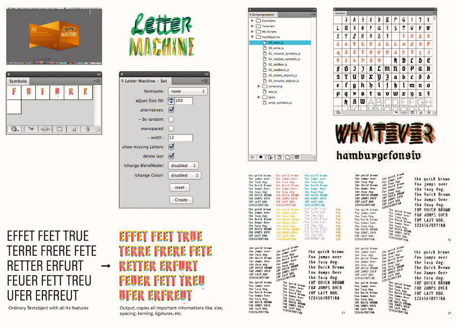

Illustrator - Type Setting Extension for Symbol Fonts / Font Production 
===========

Several scripts to simplify the work with symbolfonts in Illustrator.
So it is either for the development of ne new fonts or just to set already existing symbolfonts or so called handset type. 

#Current Features

TEXTFRAME FEATURES (change the leading, kerning, … as you are used to do)
- Leading
- Tracking
- Kerning
- Baselineshift
- Rotate
- Scale (x,y)

ADDITIONAL FEATURES
- Slant (x,y)
- Alternative Glyphs -> just name the alternative symbol e.g.: "H 1", "H 2"
  (Cycle / Random Cycle) //ToDo: why is just 1 alternative working within the random cycle?
- Seperate size adjust 
- Make Monospaced 
- Color (b/w pngs / …) 
- Blendmode

#INSTALLATION

1 Install Scriptographer (unfortunately only up to CS5)
http://scriptographer.org/tutorials/getting-started/installation-instructions/
    //It shouldn’t be too difficult to make it work in CS5.5+ (making it independent of scriptographer)
    //Further Developement more than appreciated, cause I won’t have time for it in the near future : /

2 Drop the scripts into the scriptographer script folder

#USE

1 A > Draw some Letters and make each Letter a symbol (just drag & drop to the symbol palette)
  (B > Import an image (single glyph) > embed it > drag to te symbol palette)

2 Name each symbol as the the letter it should represent. (type "a" or "&", " ", … utf-8 should work just fine)

3 Set a textframe within your Document and Type something with the Letters you already added to the symbol palette

4 Open the Scriptographer Window and run the script "00_start.js" (mark the script > push play button or CMD+E)

5 Click on "start LetterMachine"

6 Select the textframe and hit "Create"

DONE :D

----

Now your Symbol Font should get displayed next to the textframe. (on the left side;)

Any Change you make to the Text within the textframe (leading, tracking, kerning) gets directly translated to the typesetting of the symbolfont. 
Just hit "Create" again 
// ToDo: test if it would be possible to make it live (directly responding without hitting create) // or assigning a shortcut to the create button

---

#HAVE FUN! :) 

//ToDo: preview video

The original script I developed two years ago and finally decided to make public / opensource. 
Until now I only used it for my own needs of font preproduciton … //ToDo: Especially the code should get cleaned up …

some actual fonts which could benefit -> http://www.youworkforthem.com/vectors/handset-type (I think they come as svgs > import > name > go :)

Lisence: GNU GENERAL PUBLIC LISENCE
